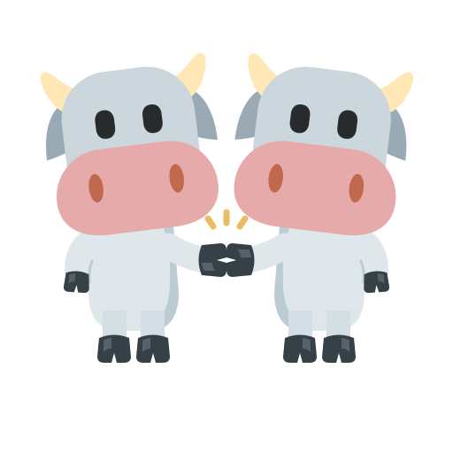

# CoCow



繁體中文 AI 工作台：聊天、工作主機切換、工具執行、模型協作與使用量顯示。

此私人儲存庫是 **0.62.26（build 114）原始碼快照**。包含目前應用程式、必要字型、品牌圖示、安裝頁與建置程式；不包含聊天紀錄、登入資訊、私鑰、執行日誌或舊測試截圖。這不是官方 OpenAI 或 Google 產品。

## 本機開發

需要 Node.js 22 以上，以及已安裝、完成登入的 Codex。Windows 為主要開發環境；可用 `CODEX_BINARY` 指定 Codex 執行檔。取得程式碼不代表自動取得原作者的模型額度或私人主機存取權。

```powershell
git clone https://github.com/evan6007/CoCow.git
cd CoCow
node outputs/codex-chat-demo/server.mjs
```

預設在 `http://127.0.0.1:4318/` 開啟。聊天資料預設保存於本儲存庫的 `work/chat-demo`，已排除 Git；亦可透過 `DEMO_DATA_DIR` 指定其他資料夾。請勿同時對同一個資料目錄啟動多份服務。

這份快照的檢查不會啟動模型或替你登入；首次執行仍需核對本機帳號、權限和工具環境。

## 專案結構

- `outputs/codex-chat-demo/`：Node.js 服務、網頁介面、模型與工作主機整合。
- `outputs/workbench-install-guide-site/dist/`：靜態安裝說明頁。
- `assets/cocow.svg`：雙牛碰蹄品牌圖示。
- `work/build-auto-update.cjs`：產生簽章更新包；會在本機建立／使用簽章私鑰，私鑰不可提交。
- `work/build-desktop.py`：桌面包組裝程式；Node 執行環境等外部建置材料需另備，儲存庫沒有附大型二進位檔。
- `SOURCE-SNAPSHOT.json`：匯出來源檔案的 SHA-256。

## 分享與部署注意事項

目前部分安裝與共享主機入口仍指向原部署的 e806 Tailscale 主機，並非可任意存取的公共服務。獨立部署前請調整主機網址、帳戶政策和更新來源。不要把現有更新公鑰誤認成你自己建立的簽章身分；獨立發行需建立並部署自己配對的公私鑰。

使用者資料放在各工作主機，GitHub 只分享程式碼。遠端功能需另行設定 Tailscale 與存取授權。Antigravity 需各使用者在自己的工作主機完成官方登入，目前整合的模型範圍以程式與 CLI 實際回報為準。

安裝教學頁保留其發布當時內容，頁面版本可能落後原始碼快照；它不是此儲存庫的 release 下載頁。目前沒有附 GitHub 安裝包，也没有原生 iOS／Android App。

## 第三方素材

牛頭圖形衍生自 [Twemoji](https://github.com/jdecked/twemoji)，採 [CC BY 4.0](https://creativecommons.org/licenses/by/4.0/)；CoCow 修改為雙牛碰蹄構圖。字型授權見 `outputs/codex-chat-demo/fonts/OFL.txt`，KaTeX 授權見應用程式內的授權檔。專案程式目前未另授予開源授權。
